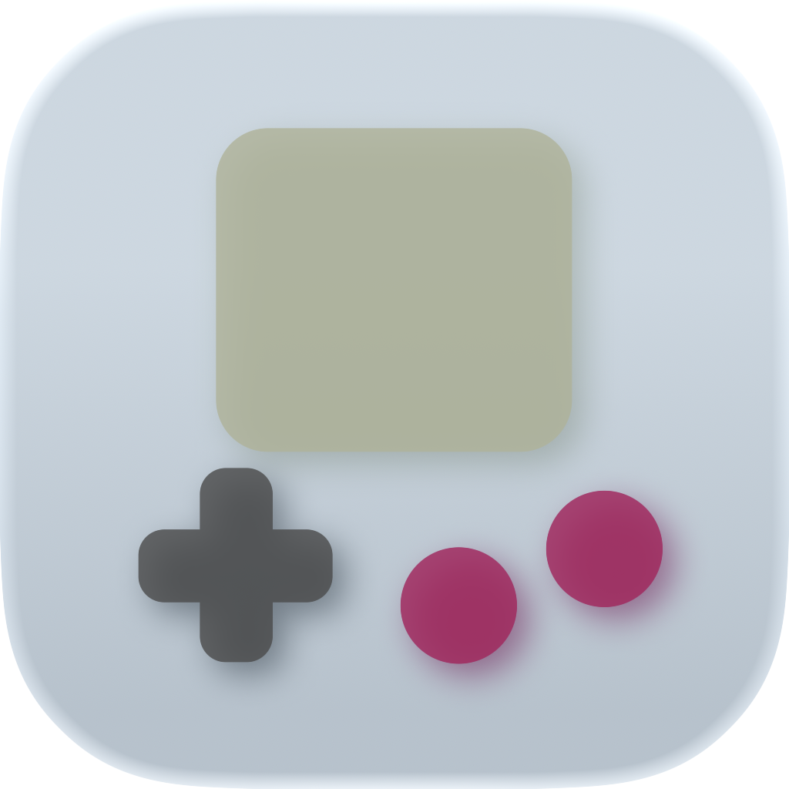
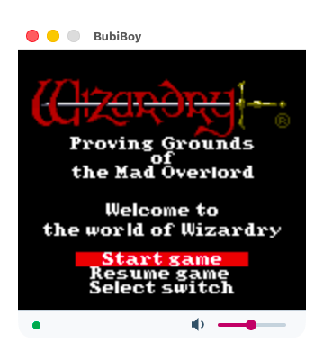
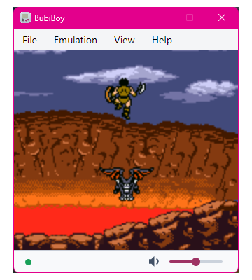
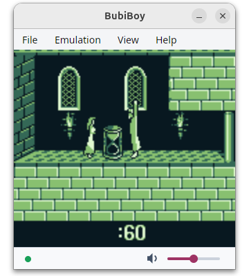

# BubiBoy

<p align="center">
  
</p>

BubiBoy is a Game Boy and Game Boy Color emulator written in F# on .NET 10.

<p align="center">
  <a href="https://github.com/bubio/BubiBoy/releases/latest">
    
  </a>
  <a href="https://github.com/bubio/BubiBoy/blob/main/LICENSE">
    
  </a>
  <a href="https://github.com/bubio/BubiBoy/releases/latest">
    
  </a>
</p>


This project is strongly experimental and is not recommended as a daily-use emulator. There are many excellent Game Boy Color emulators available today, and those are a better choice if you want reliable compatibility and a polished play experience.

It provides an Avalonia desktop app for macOS, Linux, and Windows. The emulator core is kept separate from UI, audio devices, and platform-specific APIs.


<p align="center"></p>
<p align="center"></p>
<p align="center"></p>


## Current Status

- Opens `.gb` and `.gbc` ROM files.
- Runs DMG and CGB sessions with video, audio, keyboard/controller input, pause/reset, scaling, fullscreen, and floating window mode.
- Supports ROM-only, MBC1, MBC2, MBC3, and MBC5 cartridges.
- Loads and saves battery-backed `.sav` data automatically.
- Supports save states and recent ROMs.
- Stores app settings such as volume, scale, recent ROMs, and input mappings.

Compatibility is still in progress, so some games and cartridge variants may not work correctly yet.

## Run From Source

```sh
dotnet run --project src/BubiBoy.App/BubiBoy.App.fsproj
```

## Build

```sh
dotnet build BubiBoy.slnx
dotnet test BubiBoy.slnx
```

## Publish

The managed build automatically builds the native audio wrapper for the current host RID when CMake and a
C compiler are available. Cross-RID publishing still needs a prebuilt native wrapper for the target RID;
the CI workflow does this for its artifacts.

CI publishes self-contained distribution artifacts:

- `BubiBoy-win-x64` and `BubiBoy-win-arm64`: a single-file `BubiBoy.exe`.
- `BubiBoy-<osx-rid>`: a `BubiBoy.app` bundle.
- `BubiBoy-linux-x64` and `BubiBoy-linux-arm64`: an AppImage.

### macOS

```sh
dotnet publish src/BubiBoy.App/BubiBoy.App.fsproj -c Release -r osx-arm64 --self-contained true
dotnet publish src/BubiBoy.App/BubiBoy.App.fsproj -c Release -r osx-x64 --self-contained true
```

Output: `src/BubiBoy.App/bin/Release/<rid>/BubiBoy.app`

### Linux

```sh
dotnet publish src/BubiBoy.App/BubiBoy.App.fsproj -c Release -r linux-x64 --self-contained true
dotnet publish src/BubiBoy.App/BubiBoy.App.fsproj -c Release -r linux-arm64 --self-contained true
```

Output: `src/BubiBoy.App/bin/Release/net10.0/<rid>/publish`

The CI workflow wraps this publish output as an AppImage.

### Windows

```sh
dotnet publish src/BubiBoy.App/BubiBoy.App.fsproj -c Release -r win-x64 --self-contained true -p:PublishSingleFile=true -p:IncludeNativeLibrariesForSelfExtract=true
dotnet publish src/BubiBoy.App/BubiBoy.App.fsproj -c Release -r win-arm64 --self-contained true -p:PublishSingleFile=true -p:IncludeNativeLibrariesForSelfExtract=true
```

Output: `src/BubiBoy.App/bin/Release/net10.0/<rid>/publish/BubiBoy.exe`

For packaged audio output, the native wrapper is copied under `runtimes/<rid>/native`.

## Requirements

- .NET 10 SDK
- CMake and a C compiler for native audio builds

## Third-party components and licenses

This project includes or bundles third-party components used for UI, audio, testing, and tooling. Important items:

- Avalonia (UI): Avalonia.Desktop, Avalonia.Themes.Fluent — MIT License. See https://github.com/AvaloniaUI/Avalonia
- miniaudio (native audio wrapper): bundled under native/miniaudio.h and native/miniaudio-LICENSE. miniaudio is dual-licensed (public domain or MIT No-Attribution). See https://github.com/mackron/miniaudio and the included file native/miniaudio-LICENSE for the exact text.
- BenchmarkDotNet (benchmarks): used in tests/benchmarks — MIT License.
- xUnit.net, coverlet.collector, Microsoft.NET.Test.Sdk (testing/coverage): test-time dependencies; see each project package for license details (xUnit is Apache-2.0, coverlet is MIT).

If fuller license files for runtime or test dependencies are required, they can be added to docs/ or a dedicated THIRD_PARTY_LICENSES.md on request.

## License

BubiBoy is licensed under the MIT License.
